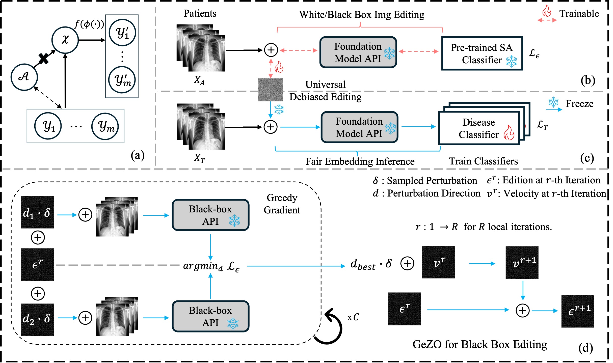

# DNE-foundation-model-fairness


## Abstract
In the era of Foundation Models' (FMs) rising prominence in AI, our study addresses the challenge of biases in medical images while the model operates in black-box (e.g., using FM API), particularly spurious correlations between pixels and sensitive attributes. Traditional methods for bias mitigation face limitations due to the restricted access to web-hosted FMs and difficulties in addressing the underlying bias encoded within the FM API. We propose a D(ebiased) N(oise) E(diting) strategy, termed DNE, which generates DNE noise to mask such spurious correlation. DNE is capable of mitigating bias both within the FM API embedding and the images themselves. Furthermore, DNE is suitable for both white-box and black-box FM APIs, where we introduced G(reedy) (Z)eroth-O(rder) (GeZO) optimization for it when the gradient is inaccessible in black-box APIs. Our whole pipeline enables fairness-aware image editing that can be applied across various medical contexts without requiring direct model manipulation or significant computational resources. Our empirical results demonstrate the method's effectiveness in maintaining fairness and utility across different patient groups and diseases. In the era of AI-driven medicine, this work contributes to making healthcare diagnostics more equitable, showcasing a practical solution for bias mitigation in pre-trained image FMs.


## Schedule

- [x] Release the train dne code.
- [x] Release the finetune FM code.
- [x] Release preprocessed datasets
- [x] Release pretrained dne and models.
- [ ] Release the demo notebooks


## Mechanism
Modern FMs are not always accessible to user, e.g., those blackbox APIs. This means that the user can _only do linear probing_ using the FM's embedding during classificion, which prevents them from using traditional bias mitigation strategies. This motivate us to propose **DNE**. The mechanism of **DNE** is to train a vector (called **DNE**) that can be added on the image so that it can mask the sensitive-atrribute-related spurious correlation during training. **DNE** can be updated in both the white-box model and black-box model. 

## Demo with Pretrained DNE
The following notebook automates all process (download metadata, data pretrained model and DNE) and provides a demo to use our pretrained DNE while finetuning the FM.
[](https://colab.research.google.com/github/Nanboy-Ronan/DNE-foundation-model-fairness/blob/main/finetune_fm_with_dne.ipynb)

## Data
We offer our preprocessed metadata [train](https://drive.google.com/file/d/1U95sIzgAdFjgbdvW2zxGCnFX3qawvMDq/view?usp=drive_link) and [valid](https://drive.google.com/file/d/1fmQqy1h8NnvAncLuxUNka22DslVmLsz2/view?usp=drive_link). You need to download the (CheXpert)[https://stanfordmlgroup.github.io/competitions/chexpert/] dataset.

## Pipeline
There are three steps to train the DNE to achieve the above performance.

Before your start:
- First download the (pretrained FM)[] and place it under `checkpoints` folder.
- Second, download the CheXpert data and metadata above and place it under `data` folder and `meta_data` folder.
- Third, you can optionally download our (pretrained DNE)[https://drive.google.com/file/d/1FERRX2nxWsIH3bNqt_hQIYrZq5tHeHlu/view?usp=drive_link] and place it under the root of this repo.

Here are commands to quite finish all above.
```bash
# Clone the repo
git clone https://github.com/Nanboy-Ronan/DNE-foundation-model-fairness
cd DNE-foundation-model-fairness

# Make directories
mkdir meta_data
mkdir checkpoints
mkdir data

# Download metadata
cd meta_data
gdown 1U95sIzgAdFjgbdvW2zxGCnFX3qawvMDq # train metadata
gdown 1fmQqy1h8NnvAncLuxUNka22DslVmLsz2 # test metadata
cd ..

# Download CheXpert https://stanfordmlgroup.github.io/competitions/chexpert/
cd data
gdown 1Q_3NA0E-iZpSgjBbrIMy5sVT8Gl3pVcP # condense CheXpert dataset (only held temporarily for purposes of demo).
unzip CheXpert-v1.0-small.zip
rm -f CheXpert-v1.0-small.zip
cd ..

# Download FM
cd checkpoints
gdown 10wqOFCkhyWp6JdSFADrH6Xu9e1am3gXJ
cd ..

# Download our pretrained DNE vector (optional)
gdown 1FERRX2nxWsIH3bNqt_hQIYrZq5tHeHlu
```

### Step 1: Train a sensitive attribute classifier with FM
This step trains a sensitive-attribute classifier with FM using linear probing.

```bash
python train_saCls.
```

### Step 2 (white-box): Train the DNE using gradient descent if the model is accessible
If the FM is accessible, where user can access its gradient and architecture, then we can optimize DNE using the gradient descent.

```bash
OMP_NUM_THREADS=1 CUDA_VISIBLE_DEVICES=0 python -m torch.distributed.launch \
    --nproc_per_node=1 \
    --master_port=12358 \
    --use_env train_dne.py \
    --output_dir "./output/your_log_folder_name/" \
    --log_dir "./output/your_log_folder_name/" \
    --batch_size 128 \
    --finetune "./checkpoints/vit-b_CXR_0.5M_mae_pretrain.pth" \
    --epochs 25 \
    --model vit_base_patch16 \
    --data_path "./data" \
    --num_workers 4 \
    --nb_classes 2 \
    --eval_interval 10 \
    --dataset "chexpert"  \
    --disease "Pleural" \
    --csv_path "./meta_data/" \
    --global_pool \
    --lambda_reg 0.001 
```

### Step 2 (black-box): Train the DNE using GeZO (greey gradient zeroth-order optimization) 
If the FM is not accessible, e.g. through a black-box API. User can choose to apply GeZO to optimize the DNE where gradient is not needed.

```bash
OMP_NUM_THREADS=1 CUDA_VISIBLE_DEVICES=0 python -m torch.distributed.launch \
    --nproc_per_node=1 \
    --master_port=12358 \
    --use_env train_dne_gezo.py \
    --output_dir "./output/your_log_folder_name/" \
    --log_dir "./output/your_log_folder_name/" \
    --batch_size 128 \
    --finetune "./checkpoints/vit-b_CXR_0.5M_mae_pretrain.pth" \
    --epochs 50 \
    --model vit_base_patch16 \
    --data_path "./data" \
    --num_workers 4 \
    --nb_classes 2 \
    --eval_interval 10 \
    --dataset "chexpert"  \
    --disease "Pleural" \
    --csv_path "./meta_data/" \
    --global_pool \
    --init_step 0.03 \
    --sampled_steps 10 \
    --lambda_reg 0.001
```

### Step 3: Finetune the FM with DNE
Finally, we train the FM. Normally, user finetune the FM using linear probing, where they take the embedding of the FM and finetune its head. With DNE added on the input images, the finetune process become more fair.
```bash
OMP_NUM_THREADS=1 CUDA_VISIBLE_DEVICES=3 python -m torch.distributed.launch \
    --nproc_per_node=1 \
    --master_port=12348 \
    --use_env finetune_fm.py \
    --output_dir "./output/your_log_folder_name/" \
    --log_dir "./output/your_log_folder_name/" \
    --batch_size 128 \
    --finetune "./checkpoints/vit-b_CXR_0.5M_mae_pretrain.pth" \
    --epochs 50 \
    --blr 2.5e-4 --layer_decay 0.55 --weight_decay 0.05 \
    --model vit_base_patch16 \
    --warmup_epochs 5 \
    --drop_path 0.2 --mixup 0 --cutmix 0 --reprob 0 --vit_dropout_rate 0 \
    --data_path "./data" \
    --num_workers 4 \
    --nb_classes 2 \
    --eval_interval 10 \
    --min_lr 1e-5 \
    --build_timm_transform \
    --aa 'rand-m6-mstd0.5-inc1' \
    --dataset "chexpert"  \
    --disease "Pleural" \
    --adddne \
    --dne_path "./path_to_your_dne.pt" \
    --csv_path "./meta_data/"
```

## Contact
If you have any question, feel free to [email](mailto:ruinanjin@alumni.ubc.ca) us. We are happy to help you.
